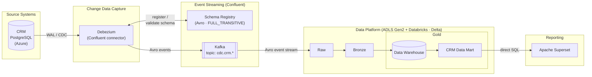

# CoLaCo IT Architecture

This document captures CoLaCo's current IT architecture as discovered to date, intended as reference material for onboarding, decisions, and system understanding.

> **Scope (final)**: this architecture documentation is permanently restricted to CRM data flows. All other data marts and upstream sources are out of scope. Decision driven by cost constraints — confirmed by IT director.

## Overall Architecture



## Systems

| System | File | Role | Status |
|--------|------|------|--------|
| CRM | [crm.md](crm.md) | System of record for customer data (PostgreSQL on Azure) | Draft |
| Debezium | [debezium.md](debezium.md) | Confluent CDC connector — streams CRM WAL changes to Kafka as Avro | Draft |
| Confluent Kafka | [confluent-kafka.md](confluent-kafka.md) | Managed event streaming backbone; CDC topics follow `cdc.<source>.<table>` | Draft |
| Confluent Schema Registry | [confluent-schema-registry.md](confluent-schema-registry.md) | Avro schema enforcement; FULL_TRANSITIVE compatibility | Draft |
| Data Platform | [data-platform.md](data-platform.md) | ADLS Gen2 + Databricks; Delta throughout; Raw → Bronze → DW → Data Marts | Draft |
| Apache Superset | [apache-superset.md](apache-superset.md) | BI reporting; queries CRM Data Mart via direct SQL | Draft |

## Known Data Flow

```
CRM PostgreSQL
  → Debezium (WAL/CDC, Confluent connector)
  → Confluent Kafka (Avro, topic: cdc.crm.<table>)
  → Data Platform raw (ADLS Gen2, Delta)
  → bronze
  → Data Warehouse (gold, Delta)
  → CRM Data Mart (gold, Delta)
  → Apache Superset (direct SQL)
```

---

## Open Topics

### 1. System Ownership

No system has a confirmed owner yet. Ownership is needed to assign accountability for incidents, changes, and roadmap decisions.

**Ask:** Who owns and is accountable for each of the following — CRM, Debezium, Confluent Kafka, Schema Registry, the Data Platform, and Apache Superset?

---

### 2. Bronze Layer Transformation Logic

The bronze layer's role — what cleaning, validation, or enrichment happens there — is undocumented. Without this, data lineage from raw to gold cannot be fully mapped.

**Ask:** What transformations are applied in the bronze layer, and who owns that logic?

---

### 3. Debezium Snapshot Mode

The Debezium connector's initial snapshot configuration is unknown. This affects how historical data is bootstrapped and what happens during a connector reset.

**Ask:** What snapshot mode is configured on the Debezium connector?

---

### 4. Kafka Retention Policies

Topic retention settings are unknown. This affects how long raw events remain available for replay or reprocessing.

**Ask:** What retention policies (time and size) are configured on the Confluent Kafka topics?

---

### 5. Schema Registry Operational Process

FULL_TRANSITIVE compatibility is confirmed. It is unknown how schema changes are reviewed, approved, and deployed in practice.

**Ask:** What is the process for proposing and applying schema changes?
