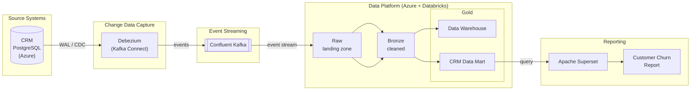

# CoLaCo IT Architecture

This document captures CoLaCo's current IT architecture as discovered to date, intended as reference material for onboarding, decisions, and system understanding.

## Overall Architecture

## Systems

| System | File | Role | Status |
|--------|------|------|--------|
| CRM | [crm.md](crm.md) | Source of record for customer data (PostgreSQL on Azure) | Draft |
| Debezium | [debezium.md](debezium.md) | CDC connector — streams CRM changes to Kafka | Draft |
| Confluent Kafka | [confluent-kafka.md](confluent-kafka.md) | Managed event streaming backbone | Draft |
| Data Platform | [data-platform.md](data-platform.md) | Azure + Databricks; raw → bronze → gold (warehouse + marts) | Draft |
| Apache Superset | [apache-superset.md](apache-superset.md) | BI and analytical reporting on top of the gold layer | Draft |

## Known Data Flow

CRM (PostgreSQL) → Debezium (WAL/CDC) → Confluent Kafka → Data Platform raw → bronze → gold (warehouse + CRM data mart) → Apache Superset

---

## Open Topics — Request for IT Director Input

The following topics require confirmation or a decision from IT leadership before this documentation can be considered complete and before architecture recommendations can be made.

### 1. System Ownership

Every system in the architecture currently has no confirmed owner. Ownership is needed to assign accountability for incidents, changes, and roadmap decisions.

**Ask:** Who owns and is accountable for each of the following — CRM, Debezium, Confluent Kafka, the Data Platform (raw / bronze / gold), and Apache Superset?

---

### 2. Data Platform Storage Layer

We know Azure is used for storage in production, but the specific service is unconfirmed. The choice between ADLS Gen2 and Blob Storage has implications for access control, analytics integration, and Databricks configuration.

**Ask:** Which Azure storage service is in use — ADLS Gen2, Blob Storage, or another?

---

### 3. Kafka Topic Naming and Governance

Kafka topic names and naming conventions are unknown. This affects how new consumers onboard and how topic lifecycle is managed.

**Ask:** What are the active Kafka topic names, and is there a naming convention or governance policy in place?

---

### 4. Debezium Deployment Model

It is unclear whether Debezium runs as a self-hosted Kafka Connect cluster or as a managed Confluent connector. This affects operational responsibility and upgrade paths.

**Ask:** Is Debezium self-hosted or deployed as a managed Confluent connector?

---

### 5. Bronze Layer Transformation Logic

The bronze layer's role — what cleaning, validation, or enrichment happens there — is undocumented. Without this, the data lineage from raw to gold cannot be fully mapped.

**Ask:** What transformations are applied in the bronze layer, and who owns that logic?

---

### 6. Gold Layer Scope

We have identified one data mart (CRM) and a Customer Churn report. Other marts and reports are likely but unknown.

**Ask:** What other data marts and reports exist in the gold layer beyond CRM / Customer Churn?

---

### 7. Apache Iceberg Adoption

Iceberg is currently under evaluation as a table format. A decision on adoption would shape how data is stored and queried across all layers.

**Ask:** Is there a timeline or decision pending on Iceberg adoption? Which layer is the intended starting point?

---

### 8. Schema Registry

It is unclear whether a Schema Registry is in use alongside Confluent Kafka. Schema Registry is critical for safe schema evolution across producers and consumers.

**Ask:** Is Confluent Schema Registry in use? If so, who manages it?

---

### 9. Superset Connectivity

It is unknown how Apache Superset connects to the gold layer — whether via direct SQL, a semantic layer, or another mechanism. This affects performance, security, and the ability to add new reports.

**Ask:** How does Superset connect to the gold layer, and is there a semantic or data modeling layer in between?
