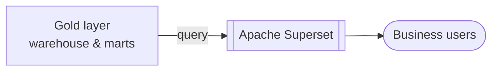

# Apache Superset

## Overview

Apache Superset is CoLaCo's analytical reporting platform. It connects to the data platform's gold layer to serve dashboards and reports to business users.

## Key attributes

| Attribute | Value |
|-----------|-------|
| Role | BI and analytical reporting |
| Data source | Data platform gold layer — see [data-platform.md](data-platform.md) |
| Owners | _To be confirmed_ |

## Known reports

| Report | Data mart | Description |
|--------|-----------|-------------|
| Customer Churn | CRM | _To be confirmed_ |

## Data flow

## Open questions

- Who owns and administers the Superset instance?
- Is Superset self-hosted or managed (e.g., on Azure)?
- How does it connect to the gold layer — direct SQL, a semantic layer, or another connector?
- What other reports and dashboards exist beyond Customer Churn?
- Who are the primary consumers of the reports?
