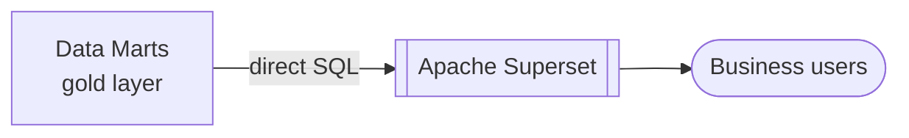

# Apache Superset

## Overview

Apache Superset is CoLaCo's analytical reporting platform. It connects to the data platform's gold layer to serve dashboards and reports to business users.

## Key attributes

| Attribute | Value |
|-----------|-------|
| Role | BI and analytical reporting |
| Data source | Data Marts (gold layer) — see [data-platform.md](data-platform.md) |
| Connection method | Direct SQL |
| Owners | Analytics Team |

## Known reports

| Report | Data mart | Owner | Description |
|--------|-----------|-------|-------------|
| Customer Churn | CRM | CRM | The rate at which customers stop subscribing to or purchasing a company’s products/services, indicating a loss in revenue and customer base |

## Data flow

> **Scope note**: current documentation effort covers CRM data flows only.

## Open questions

- Who owns and administers the Superset instance?
- Is Superset self-hosted or managed (e.g., on Azure)?
- What other reports and dashboards exist beyond Customer Churn?
- Who are the primary consumers of the reports?
