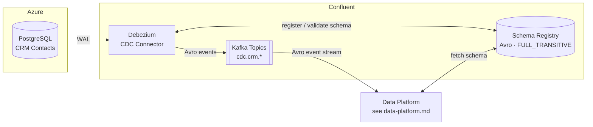

# Confluent Kafka

## Overview

CoLaCo's event streaming layer is built entirely on the Confluent managed platform. It is composed of three tightly coupled components: the **Debezium CDC connector** (captures changes from source databases), the **Kafka cluster** (event backbone), and the **Schema Registry** (Avro schema enforcement). All three are operated by the Confluent Kafka Team.

## Components

### Debezium — CDC Connector

Runs as a managed Confluent connector. Tails the PostgreSQL WAL of source databases and publishes row-level change events to Kafka in real time as Avro-encoded messages.

| Attribute | Value |
|-----------|-------|
| Deployment | Confluent Cloud connector |
| Source databases | CRM PostgreSQL (Azure) — see [crm.md](crm.md) |
| Serialization | Avro (validated against Schema Registry) |
| Topic naming | `cdc.<source-system-name>.<schema>.<source-table-name>` |
| Owners | Confluent Kafka Team |

**Open questions**
- Are there other source databases beyond CRM PostgreSQL?
- What snapshot mode is configured?

---

### Kafka Cluster

Managed Confluent Kafka cluster. Acts as the central event streaming backbone between source systems and the data platform.

| Attribute | Value |
|-----------|-------|
| Platform | Confluent (managed Kafka) |
| CDC topic pattern | `cdc.<source-system-name>.<schema>.<source-table-name>` |
| Producers | Debezium (CDC connector) |
| Consumers | Data platform (raw layer) — see [data-platform.md](data-platform.md) |
| Owners | Confluent Kafka Team |

**Open questions**
- What retention policies (time and size) are configured?
- Are there consumers beyond the data platform?

---

### Schema Registry

Confluent-managed Schema Registry. Enforces Avro schemas on all messages produced and consumed via the Kafka cluster.

| Attribute | Value |
|-----------|-------|
| Platform | Confluent Schema Registry (managed) |
| Serialization format | Avro only |
| Compatibility mode | FULL_TRANSITIVE |
| Producers | Debezium (CDC connector) |
| Consumers | Data platform — see [data-platform.md](data-platform.md) |
| Owners | Confluent Kafka Team |

**Open questions**
- How are schema evolution and breaking changes managed operationally (review process, tooling)?

---

## Data flow

> **Scope note**: current documentation covers CRM data flows only.

