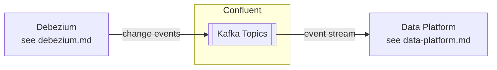

# Confluent Kafka

## Overview

CoLaCo uses a managed Confluent Kafka cluster as the central event streaming backbone. It receives CDC events from Debezium and feeds downstream systems, including the data platform.

## Components

### Confluent Cluster

| Attribute | Value |
|-----------|-------|
| Platform | Confluent (managed Kafka) |
| Topic naming (CDC) | `cdc.<source-system-name>.<schema>.<source-table-name>` |
| Schema Registry | Confluent Schema Registry, Avro only — see [confluent-schema-registry.md](confluent-schema-registry.md) |
| Producers | Debezium — see [debezium.md](debezium.md) |
| Consumers | Data platform (raw area) — see [data-platform.md](data-platform.md) |
| Owners | Confluent Kafka Team |

## Data flow

> **Scope note**: current documentation effort covers CRM data flows only.

## Open questions

- What retention policies are configured?
- Are there consumers beyond the data platform?
- Who owns and operates the Confluent cluster?
