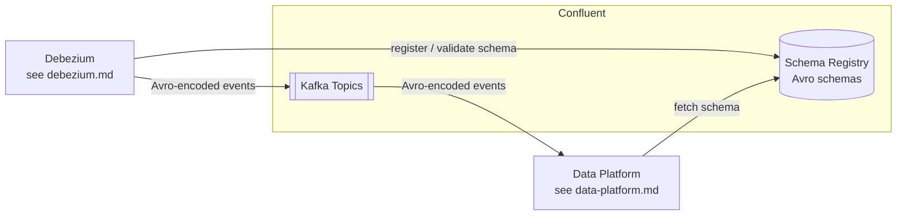

# Confluent Schema Registry

## Overview

CoLaCo uses Confluent Schema Registry to enforce and version message schemas across the Kafka cluster. All messages use Avro serialization; other formats (Protobuf, JSON Schema) are not in use.

## Components

### Schema Registry

| Attribute | Value |
|-----------|-------|
| Platform | Confluent Schema Registry (managed) |
| Serialization format | Avro only |
| Compatibility mode | FULL_TRANSITIVE |
| Producers | Debezium (CDC events) — see [debezium.md](debezium.md) |
| Consumers | Data platform — see [data-platform.md](data-platform.md) |
| Owners | _To be confirmed_ |

## Data flow

## Open questions

- Who owns and operates the Schema Registry?
- How are schema evolution and breaking changes managed operationally (review process, tooling)?
