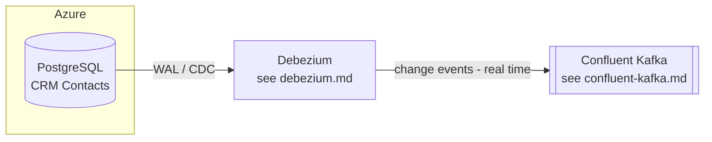

# CRM

## Overview

CoLaCo's CRM domain manages customer contact data. The primary store is a cloud-managed PostgreSQL instance on Azure. Changes to that database are streamed in real time via Debezium CDC into Confluent Kafka.

## Components

### PostgreSQL (Azure)

| Attribute | Value |
|-----------|-------|
| Provider | Azure Database for PostgreSQL |
| Primary use | CRM contact records |
| Owners | _To be confirmed_ |

## Integrations

| System | Role | Doc |
|--------|------|-----|
| Debezium | Captures WAL changes from PostgreSQL and publishes to Kafka | [debezium.md](debezium.md) |
| Confluent Kafka | Event streaming backbone receiving CDC events | [confluent-kafka.md](confluent-kafka.md) |

## Data flow

## Open questions

- Who owns / operates the PostgreSQL instance?
- What Kafka topics carry CRM events?
