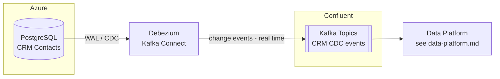

# CRM

## Overview

CoLaCo's CRM domain manages customer contact data. The primary store is a cloud-managed PostgreSQL instance on Azure. Changes to that database are streamed in real time to a Confluent Kafka cluster via Debezium CDC.

## Components

### PostgreSQL (Azure)

| Attribute | Value |
|-----------|-------|
| Provider | Azure Database for PostgreSQL |
| Primary use | CRM contact records |
| Owners | _To be confirmed_ |

### Debezium

Debezium is deployed as a Kafka Connect connector. It tails the PostgreSQL WAL (write-ahead log) and publishes row-level change events (insert / update / delete) to Confluent Kafka topics in real time.

### Confluent Kafka

Receives the CDC event stream from Debezium. Downstream consumers (unknown at this time) read from these topics.

| Attribute | Value |
|-----------|-------|
| Platform | Confluent (managed Kafka) |
| Topics | _To be confirmed_ |
| Consumers | Data platform (raw area) — see [data-platform.md](data-platform.md) |

## Data flow

## Open questions

- Who owns / operates the PostgreSQL instance and the Debezium connector?
- What Kafka topics are used for CRM events?
- What downstream services consume those topics?
- Is there a schema registry in use with Confluent?
