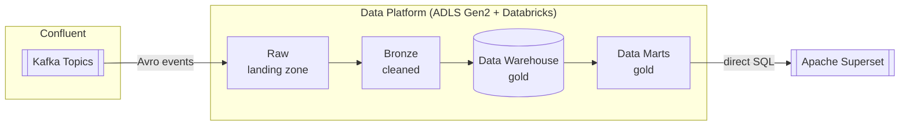

# Data Platform

## Overview

CoLaCo's data platform ingests event streams from Confluent Kafka and processes them through three layers — raw, bronze, and gold — stored on Azure storage and processed with Databricks.

## Storage

### Azure Data Lake Storage Gen2 (ADLS Gen2)

ADLS Gen2 is the primary storage layer for all data platform layers in production.

| Attribute | Value |
|-----------|-------|
| Service | Azure Data Lake Storage Gen2 |
| Role | Primary storage for all layers (raw, bronze, gold) |
| Owners | _To be confirmed_ |

## Processing

### Databricks

Databricks is the compute and processing layer for the data platform.

| Attribute | Value |
|-----------|-------|
| Role | Data processing across raw, bronze, and gold layers |
| Owners | _To be confirmed_ |

## Layers

### Raw

Landing zone for incoming Kafka events. Data is written to ADLS Gen2 with no transformation — preserving the original Avro event payload exactly as received.

| Attribute | Value |
|-----------|-------|
| Table format | Delta |
| Storage | ADLS Gen2 |
| Sources | Confluent Kafka — see [confluent-kafka.md](confluent-kafka.md) |
| Transformation | None |
| Owners | _To be confirmed_ |

### Bronze

Holds cleaned or validated data derived from the raw layer.

| Attribute | Value |
|-----------|-------|
| Table format | Delta |
| Storage | ADLS Gen2 |
| Sources | Raw layer |
| Transformation | _To be confirmed_ |
| Owners | _To be confirmed_ |

### Gold

Holds the Data Warehouse and domain-specific Data Marts. The Data Warehouse is the central hub of the gold layer; Data Marts are derived from it and serve as the semantic model queried by Apache Superset — see [apache-superset.md](apache-superset.md).

| Attribute | Value |
|-----------|-------|
| Table format | Delta |
| Storage | ADLS Gen2 |
| Sources | Bronze layer |
| Transformation | Aggregation and modelling into Data Warehouse and Data Marts |
| Owners | _To be confirmed_ |

#### Gold structure

```
Bronze → Data Warehouse → Data Marts → Apache Superset (direct SQL)
```

#### Data Marts (in scope: CRM)

> **Scope note**: per IT director, current documentation effort covers CRM data flows only.

| Mart | Domain | Known reports |
|------|--------|---------------|
| CRM | CRM contact and customer data | Customer Churn |

## Data flow



## Development Environment

In local development, ADLS Gen2 is replaced by **MinIO** — an S3-compatible object store that mirrors the ADLS interface so local workloads run without cloud credentials.

| Component | Role | Status |
|-----------|------|--------|
| MinIO | Local stand-in for ADLS Gen2 | Local dev only |

## Open questions

- Who owns and operates the data platform?
- What Kafka topics beyond CRM CDC feed into the raw layer (out of current scope)?
- What is the Bronze transformation logic?
- How is schema evolution handled across Delta layers?
