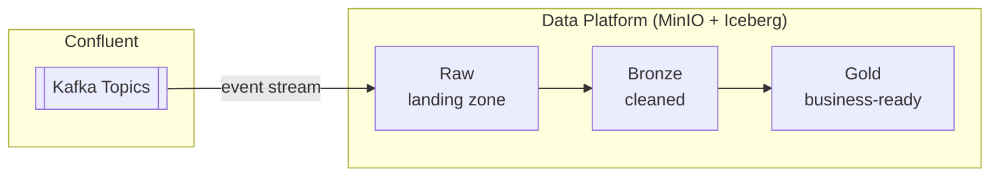

# Data Platform

## Overview

CoLaCo's data platform ingests event streams from Confluent Kafka and processes them through three layers — raw, bronze, and gold — stored on MinIO using Apache Iceberg tables.

## Storage

### MinIO

Object storage layer that backs all three data platform layers.

| Attribute | Value |
|-----------|-------|
| Role | Primary storage for the data platform |
| Owners | _To be confirmed_ |

## Layers

### Raw

Landing zone for incoming Kafka events. Data is written as Apache Iceberg tables on MinIO with no transformation — preserving the original event payload exactly as received.

| Attribute | Value |
|-----------|-------|
| Table format | Apache Iceberg |
| Storage | MinIO |
| Sources | Confluent Kafka — see [confluent-kafka.md](confluent-kafka.md) |
| Transformation | None |
| Owners | _To be confirmed_ |

### Bronze

_To be confirmed_ — expected to hold cleaned or validated data derived from the raw layer.

| Attribute | Value |
|-----------|-------|
| Table format | _To be confirmed_ |
| Storage | MinIO |
| Sources | Raw layer |
| Transformation | _To be confirmed_ |
| Owners | _To be confirmed_ |

### Gold

_To be confirmed_ — expected to hold aggregated or business-ready data derived from the bronze layer.

| Attribute | Value |
|-----------|-------|
| Table format | _To be confirmed_ |
| Storage | MinIO |
| Sources | Bronze layer |
| Transformation | _To be confirmed_ |
| Owners | _To be confirmed_ |

## Data flow

## Open questions

- Who owns and operates the data platform?
- What other Kafka topics (beyond CRM) feed into the raw layer?
- What is the Bronze transformation logic?
- What is the Gold aggregation / serving model?
- What query engine reads from the Iceberg tables (e.g., Trino, Spark, Dremio)?
- How is schema evolution handled across layers?
