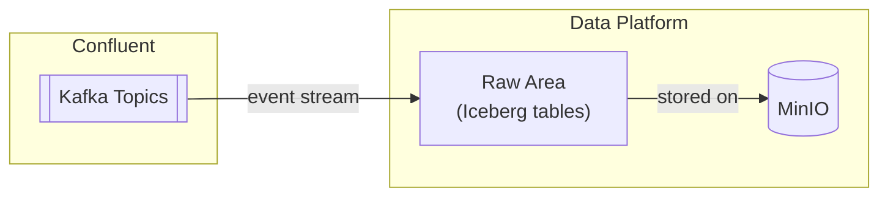

# Data Platform

## Overview

CoLaCo's data platform ingests event streams from Confluent Kafka and persists them in a raw storage layer built on MinIO using the Apache Iceberg table format.

## Components

### MinIO

Object storage layer that backs the data platform.

| Attribute | Value |
|-----------|-------|
| Role | Primary storage for the data platform |
| Owners | _To be confirmed_ |

### Raw Area (Iceberg)

The raw area is the landing zone for incoming events. Data is persisted as Apache Iceberg tables on top of MinIO, preserving the original event payload without transformation.

| Attribute | Value |
|-----------|-------|
| Table format | Apache Iceberg |
| Storage | MinIO |
| Sources | Confluent Kafka (CRM CDC events; others TBC) |
| Owners | _To be confirmed_ |

## Data flow

## Open questions

- Who owns and operates the data platform?
- What other Kafka topics (beyond CRM) feed into the raw area?
- Are there additional layers beyond raw (e.g., curated, serving)?
- What tooling reads from the Iceberg tables (query engine, BI tool)?
- How is schema evolution handled in the Iceberg tables?
