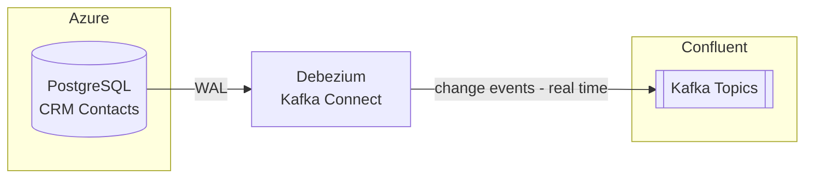

# Debezium

## Overview

Debezium is CoLaCo's Change Data Capture (CDC) layer. It runs as a Kafka Connect connector and tails the write-ahead log (WAL) of source databases, publishing row-level change events (insert / update / delete) to Confluent Kafka in real time.

## Components

### Kafka Connect Connector

| Attribute | Value |
|-----------|-------|
| Deployment | Confluent Cloud connector |
| Source databases | CRM PostgreSQL (Azure) — see [crm.md](crm.md) |
| Sink | Confluent Kafka — see [confluent-kafka.md](confluent-kafka.md) |
| Serialization | Avro (via Confluent Schema Registry — see [confluent-schema-registry.md](confluent-schema-registry.md)) |
| Topic naming | `cdc.<source-system-name>.<schema>.<source-table-name>` |
| Owners | Confluent Kafka Team |

## Data flow

## Integrations

| Source | Description |
|--------|-------------|
| CRM | Systems of Record for subscriptions, marketing campaigns, customer data and more. | [crm.md](crm.md) |

## Open questions

- Are there other source databases beyond CRM PostgreSQL?
- What snapshot mode is configured?
