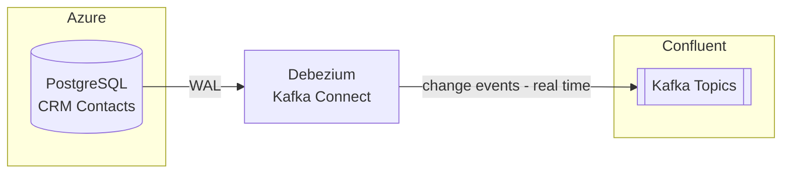

# Debezium

## Overview

Debezium is CoLaCo's Change Data Capture (CDC) layer. It runs as a Kafka Connect connector and tails the write-ahead log (WAL) of source databases, publishing row-level change events (insert / update / delete) to Confluent Kafka in real time.

## Components

### Kafka Connect Connector

| Attribute | Value |
|-----------|-------|
| Deployment | _To be confirmed_ |
| Source databases | CRM PostgreSQL (Azure) — see [crm.md](crm.md) |
| Sink | Confluent Kafka — see [kafka.md](kafka.md) |
| Owners | _To be confirmed_ |

## Data flow

## Open questions

- Where is Debezium deployed (self-hosted, Confluent Cloud connector, other)?
- Who owns and operates the Debezium connector?
- Are there other source databases beyond CRM PostgreSQL?
- What is the connector configuration (snapshot mode, topic naming, serialization format)?
